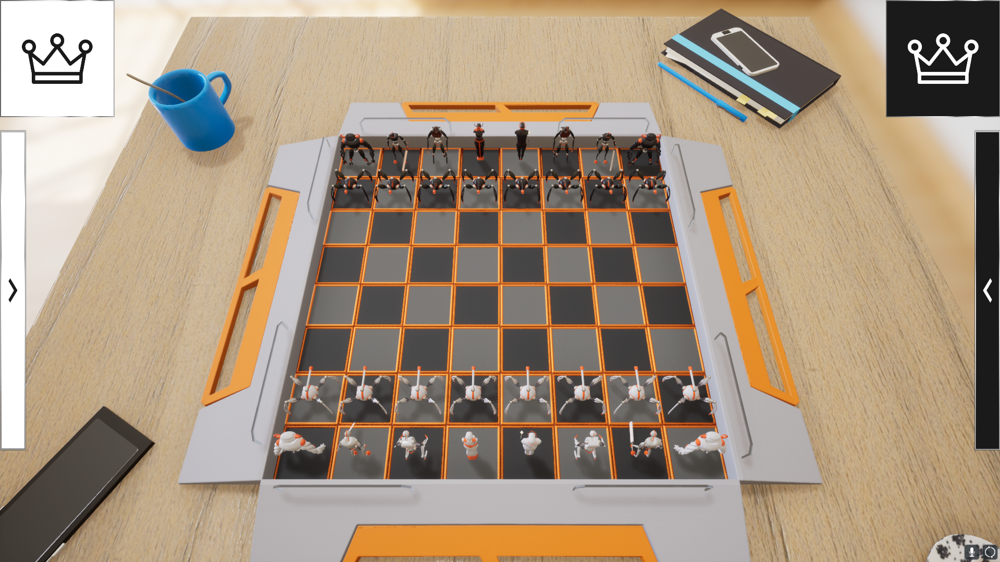

# VFX Chess
*MADE by CAVE* 
*Group Project.* 
*NCCA, Bournemouth University.* 
*2020 - 2021.* 

## Contents
1. [Overview](#overview)
2. [Team](#team)

## Overview
...

## Team
| Member | Course | Role |
| ------------ | ------------ | ------------ |
| Josh Bailey | MSc CAVE | Project Lead / Programmer |
| Dmitrii Shevchenko | MSc CAVE | Rigging / Animation |
| Brett Fawkes | MADE | 3D Artist |
| Birte Ahrens | MADE | 3D Artist |
| Seyi Oyekoya | MADE | 3D Artist |
| Aslan Saparov | MSc CAVE | UI Programmer |
